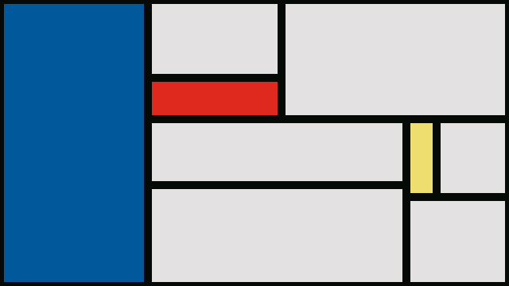

paint-squares
=============

A program made with [raylib (v4.5)][1] to paint compositions similar to
[some made by Piet Mondrian][2]. Inspired by [Mondrian And Me][3].

How to run this program?
------------------------

The _Makefile_ contains the instructions for compiling this program.
Make sure you have _raylib_ (v4.5), _make_ and a _C99_ compatible
compiler. Configure the _Makefile_ accordingly and run `make` to compile
and `./paint-squares` to execute.

Controls
--------

Mouse:  
 - Mouse left button -> Paint a line at the cursor position.  

Keyboard:  
 - P -> Take screenshot of the program window.  
 - C -> Clear the window.  
 - ESCAPE -> Exit program.  

Author
------

This program was written by daniel.source and is Copyright (C) 2023.
The source code is released under the zlib License.

[1]: https://www.raylib.com/
[2]: https://en.wikipedia.org/wiki/Piet_Mondrian#/media/File:Piet_Mondriaan,_1930_-_Mondrian_Composition_II_in_Red,_Blue,_and_Yellow.jpg
[3]: https://github.com/tholman/mondrian-and-me
